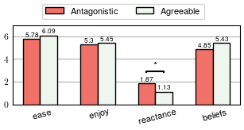
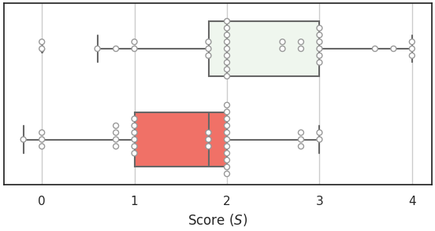
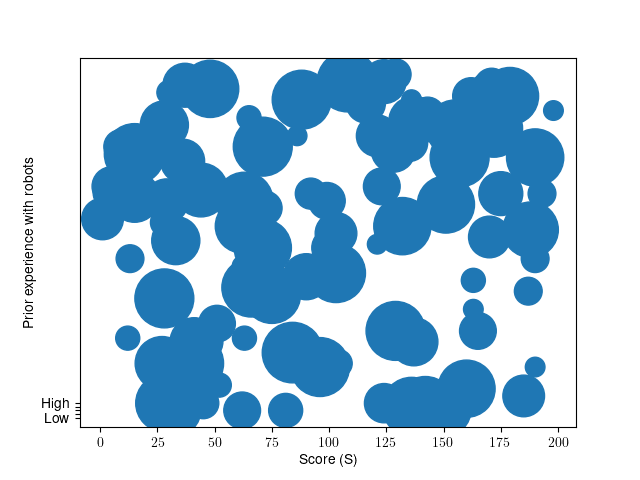

# NicePlots
```
High-resolution plots for your research manuscript (sweet: the little p-value-line-with-an-* can be done by matplotlib)
```

Here are some Jupiter Notebooks with python code I use for creating Hi-Res plots for my research. When reporting significant differences on plots, the usual approach is to modify the rasterred image manually (efficient but not the most elegant solution).
Annotations can be added with matplotlib with compatible IEEE standard font (no font 3).

Here you can find:
- Vertical barplot with horizontal bar for significant differences
- Horizontal barplot with data points
- Scattered plot in which the size of each circle tunable

## Vertical Bar Plot with significant differences

The notebook [bar_plot_with_annotation.ipynb](./bar_plot_with_annotation.ipynb) generates:



### Details
Here you have 8 ``Patches`` objects, one per each drawn box. To use the annotation function you have to provide as argument to the function the initial and the final ``Patch``.
In this case, the bars we want to annotate have indexes 4 and 5 starting at 0 on the leftmost one:

``annotate_barplot_dataframe(4, 5, "*", patches, 1)``


## Horizontal Bar Plot with datapoints
The notebook [horizontal_bar_plot.ipynb](./horizontal_bar_plot.ipynb) generates:



### Details
Here, we use the library `seaborn` to overlay the data points to the horizontal bar plot.

Stack the points vertically with:
``
sns.swarmplot(x="score", y="type", data=new_df,
              size=5, color="1", linewidth=1, orient="h")
``

Cluster the points automatically with:
``
sns.stripplot(x="score", y="type", data=new_df,
              # size=5, color="1", linewidth=1)
``


## Scattered frequency
The notebook [scatter_frequency.ipynb](./scatter_frequency.ipynb) generates:



Be aware that the variable `s` should contain the occurrences of the pair `x,y` to show appropriate results.

### Tips
Avoid the No Font 3 error from paperplaza with

```
import matplotlib as mtp
mtp.rcParams['pdf.fonttype'] = 42
```

## Credits
I found the function for annotations, online some years ago. Is not mine but I adapted it to my needs.
If you know the author, would love to acknowledge it! 


```python
def annotate_barplot_dataframe(bar0, bar1, text, patches, dh=0.2, c='black'):
    """annotate a grouped barplot from a pandas dataframe
    An annotation is built from bar0 to bar1

    Args:
        bar0 (int): index of first bar
        bar1 (int): index of second bar
        text (string): what to write on the annotation
        patches (matplotlib.patches): data source
    """
    patches.sort(key=lambda x: x.xy[0])
    left = patches[bar0]
    right = patches[bar1]
    y = max(left._height, right._height) + dh

    l_bbox = left.get_bbox()
    l_mid = l_bbox.x1 - left._width / 2

    r_bbox = right.get_bbox()
    r_mid = r_bbox.x1 - right._width / 2
    barh = 0.07
    barx = [l_mid, l_mid, r_mid, r_mid]
    bary = [
        y,
        y + barh,
        y + barh,
        y,
    ]  # lower-left, upper-left, upper-right, lower-right
    plt.plot(barx, bary, c=c)
    kwargs = dict(ha="center", va="bottom")
    # if fs is not None:
    # kwargs['fontsize'] = fs
    mid = ((l_mid + r_mid) / 2, y + 0.01)
    plt.text(*mid, text, **kwargs)
```
